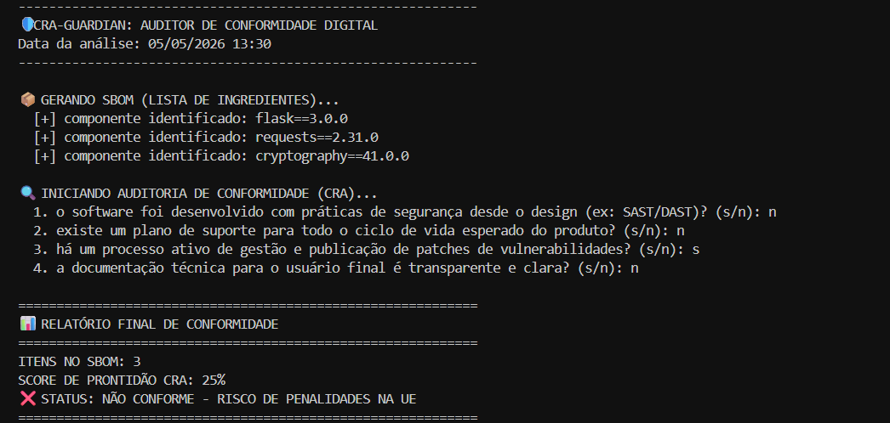

<h1 align="center">🛡️ CRA-Guardian: SBOM & Compliance Auditor</h1>

  
  
  

---

## 📖 Sobre a Origem do Projeto

Este projeto foi desenvolvido como parte prática do módulo **CRA: EL MARCADO CE DEL SOFTWARE**, integrante do curso de Ciberseguridad Aplicada da **Universidad de Salamanca (USAL)** e do projeto **CIBERIA**.

A **Cyber Resilience Act (CRA)** é a primeira regulação horizontal da União Europeia que estabelece requisitos obrigatórios de cibersegurança para produtos com elementos digitais. O objetivo central é garantir que hardware e software incorporem medidas de segurança antes de serem comercializados no mercado europeu.

---

## 🎯 Justificativa: Do Físico ao Digital

Historicamente, o marcado CE focava na segurança física (brinquedos, máquinas, eletrodomésticos) para evitar danos aos consumidores. A CRA expande esse conceito: agora, produtos digitais devem demonstrar que cumprem requisitos básicos de cibersegurança para serem vendidos na UE.

O **CRA-Guardian** automatiza a verificação de dois pilares críticos desta lei:
1.  **Segurança desde o Design (Security by Design):** A segurança deve ser integrada desde o início do desenvolvimento, e não como uma fase final.
2.  **Gestão de Vulnerabilidades:** Fabricantes devem monitorar, documentar e publicar atualizações durante todo o ciclo de vida do produto.

---

## 🚀 Funcionalidades Técnicas

### 📦 Geração de SBOM (Software Bill of Materials)
O script gera um inventário estruturado (a "lista de ingredientes") de todos os componentes e dependências do software.
* **Por que importa?** Permite reagir rapidamente a vulnerabilidades conhecidas (como o Log4j), identificando em minutos quais produtos estão afetados.

### 🔍 Auditoria de Prontidão (Checklist)
O sistema avalia a conformidade do projeto com base nas obrigações legais da CRA:
* Verificação de práticas de **SDLC Seguro**.
* Avaliação da transparência das informações fornecidas ao usuário final.
* Auditoria de planos de suporte para o ciclo de vida esperado do produto.

---

## 💻 Exemplo Prático de Execução

Ao rodar o auditor em um projeto que possui dependências mas falha nos processos de suporte e design seguro, o sistema identifica o risco de penalidades legais. Abaixo, um exemplo da ferramenta identificando um software com **apenas 25% de conformidade**:

  

> **Nota:** Este resultado indica que, embora o SBOM tenha sido gerado e haja gestão de vulnerabilidades, o produto falha em requisitos essenciais para obter o **Marcado CE Digital**.

---

## 👩‍💻 Autora

**Victória Santos Suares da Silva** *Estudante de Engenharia de Software e Pesquisadora em IA Justa e Transparente.* Foco em Segurança Ofensiva, Análise de Vulnerabilidades e Ciberdireito.

* **LinkedIn:** [https://www.linkedin.com/in/victoria-suares/](https://www.linkedin.com/in/victoria-suares/)
* **GitHub:** [@suares13](https://github.com/suares13)
